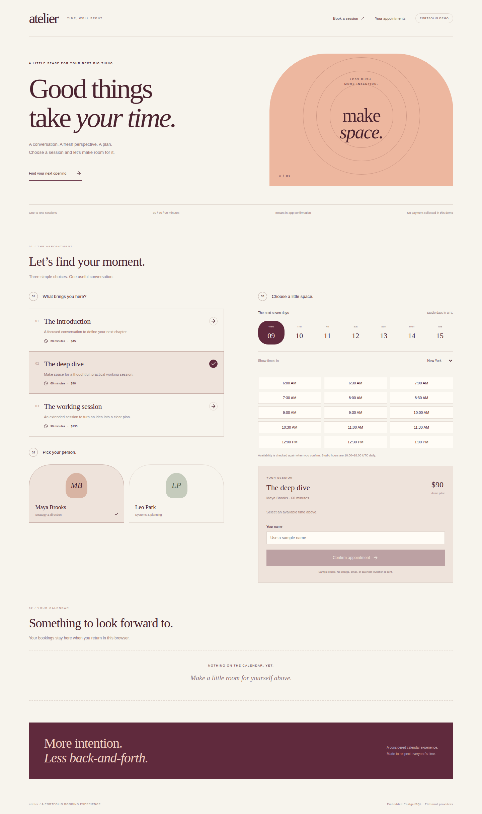

# Atelier / Appointment Booking Platform

[](https://github.com/grantmaye/Appointment-Booking-Platform/actions/workflows/ci.yml)

A studio appointment experience with an editorial cream, burgundy, and peach design. Choose a session, provider, and opening; confirm, reschedule, or cancel it through a GraphQL API backed by PostgreSQL.



## Learn this repository

- [Technical manual](docs/technical-manual.md): architecture, contracts, setup, tests, failure labs, extension exercises with solutions, and interview preparation.
- [Product story](docs/product-story.md): intended users, a hypothetical benefit scenario, limitations, and a 60–90 second demo.

## Run locally

Node 22.13 or newer:

```sh
npm ci
npm run dev
```

Open http://localhost:3000. Embedded PGlite persists in `.data/atelier`; no accounts or API keys are required. Optional DATABASE_URL in `.env.local` enables external PostgreSQL. APP_ORIGIN configures the public origin behind a reverse proxy.

The providers, services, and prices are fictional. Use a sample customer name. No payment is collected and no email or calendar invitation is sent. Confirmation is in-app only.

## Walkthrough

Pick a service and provider. Choose one of the next seven studio days, change the display timezone, select an opening, and confirm. Your appointment appears below. Reload to verify persistence, then reschedule and cancel it. Availability reflects bookings in your cookie-scoped demo workspace.

## Why the backend matters

- Services occupy 30, 60, or 90 minutes. Each appointment claims every 30-minute block it spans, not just its starting time.
- A unique PostgreSQL key on workspace, provider, and occupied block protects against double allocation. Service transactions serialize a workspace and recheck availability before inserting blocks.
- Rescheduling checks the new range and moves its blocks in one transaction. A conflict leaves the original booking intact.
- A request key makes creation retryable. Replaying the same key and payload returns the existing appointment; reusing it with different details is rejected. A replay after cancellation returns the original cancelled record.
- Changes carry an expected version to reject stale edits. Events record booking, rescheduling, and cancellation.
- Availability shown in the browser is advisory. The transaction makes the final decision.

## Time model

The sample studio is open daily from 10:00 to 18:00 UTC. Day selectors are explicitly UTC studio days. The API stores canonical UTC ISO timestamps, while Intl.DateTimeFormat displays them in New York, Los Angeles, London, or UTC. A slot's local calendar date can differ from its studio date; the confirmation includes the localized date.

This avoids pretending to support arbitrary provider business calendars. Production hours should be defined in each provider's IANA timezone, with explicit handling of daylight-saving gaps and repeated times, holidays, buffers, and exceptions.

## Verify

```sh
npm run check
npm run build
npx playwright install chromium
npm run test:e2e
```

CI repeats service tests against PGlite and PostgreSQL and exercises desktop/mobile booking, persistence, rescheduling, and cancellation. Tests cover competing requests, overlap, replay keys, failed reschedules, stale versions, cancellation release, and isolation.

## Project map

| File                       | Responsibility                              |
| -------------------------- | ------------------------------------------- |
| src/lib/model.ts           | Catalog and UTC slot generation             |
| src/lib/service.ts         | Atomic booking, replay and schedule changes |
| src/lib/schema.ts          | Appointment and occupied-block constraints  |
| src/lib/graphql.ts         | Typed queries and mutations                 |
| src/components/booking.tsx | Customer booking flow                       |

[Engineering notes and interview discussion](docs/engineering.md)

## Scope and next steps

This is an anonymous demo workspace, not an authenticated customer portal. Cookies are unsigned random identifiers. The backend has a simulated viewer guard, but the customer interface uses demo operator access. Limits are 100 appointments per workspace and 50 events per appointment. Initial schema creation is not a versioned migration framework. Aggregate appointment reads are bounded by the demo quota rather than a paginated client.

Production work includes verified customer/provider identity, authorization, persistent provider calendars, cancellation policies, payment holds, durable notifications, rate limits, privacy controls, workspace expiry, migrations, and booking pagination. A Node host is required; GitHub Pages cannot run this backend.

MIT licensed.
